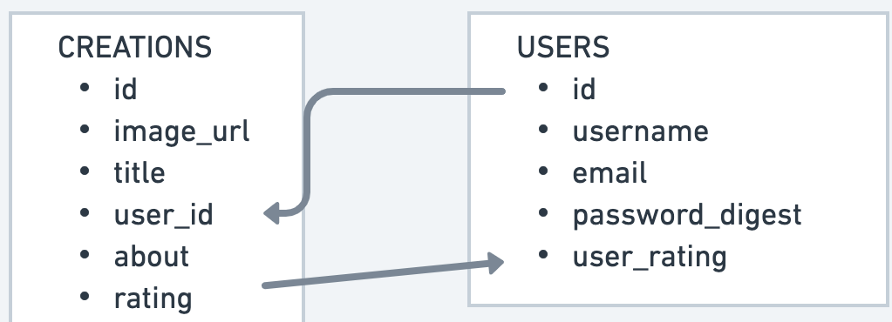

# The Brick Wall
A place to showcase your awsome creations using Lego bricks. Get inspired by people's imagination and creativity and vote the models you love.

- Users can post a picture of their creations, write a story/plot, time/difficulty level.
- Rate others creations.
- Edit / delete their own posts.
- Search posts by keyword / username / difficulty level.
- Short posts by Date posted
- Clicking on the post name displays image, title, creator, story/plot, rating.
- Clicking on user profile / username shows a list of all their posts and possibly a user rating.
- Check if username already taken, prevent duplicacy
- change password/forgot password
- strong password
- valid email verification
- user avatar choices

# Technologies used
CRUD App built using
- HTML
- CSS
- Javascript (Node Js and Express JS)
- PostgreSQL

# Plan

